---

<!-- _class: lead -->

# Docker & Kubernetes

What containers are, why they exist, and how clusters run them
North South University · Introductory Session


<!--
Speaker notes: Assume zero background. Nobody here has deployed anything. Say that out loud so people relax: 'if you have never heard any of these words, you are exactly who this is for.'
-->

---

# What we are actually answering today

**A vocabulary and mental-model session, not a command tutorial.**

| Question | The answer we will build up to |
|---|---|
| Why is shipping software hard? | An app is code PLUS a whole environment |
| What is a container? | A process the kernel isolates, so it carries its environment with it |
| What is Docker? | The tool that builds and runs containers |
| Why is one machine not enough? | It fails, it fills up, and it cannot be updated without downtime |
| What is Kubernetes? | A system that keeps containers running correctly across many machines |

> No question is too basic — stop me the moment a word is unfamiliar. Everything is in the repo; you never need to copy from a slide.


<!--
Speaker notes: Show of hands: who has heard of Docker, who has run it, who has touched Kubernetes. Calibrate from there.
-->

---

<!-- _class: lead -->

<span class="kicker">CHAPTER</span>

# Part 1 — Why containers exist

The problem, and the idea that solved it

---

# First: what does “running an app” actually need?

**Your code is the smallest part of what has to be correct.**

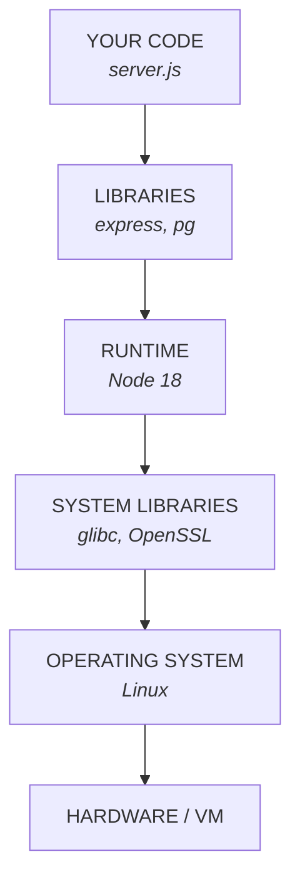

*the part you wrote* · *code other people wrote* · *the thing that executes it* · *the OS's shared plumbing* · *files, processes, network*

> Change any one layer and the app can break. "It works" means all six happen to agree.


<!--
Speaker notes: Draw this on the board if you can. Everything hangs off it — a container is literally a way to ship the middle four layers together.
-->

---

# The oldest sentence in software

**“But it works on my machine.”**

<span style="font-size:2.2em">🧩</span>

- Rakib writes it on Ubuntu, Node 20, Postgres 16 — works perfectly
- Nusrat pulls the same code on macOS with Node 16 — crashes on startup
- The university server has Node 18 and no database — every request 500s
- What differs: OS version, runtime version, system libraries, installed services, environment variables, file paths, locale, timezone

> Nobody wrote bad code. Your app is not just your code — it is your code plus everything it assumes about the machine.


<!--
Speaker notes: Ask who has lost an evening to a setup problem that was not their code. Almost every hand goes up. That is the hook.
-->

---

<!-- _class: lead -->

<p class="emoji">💻</p>

# “It works on my machine.”

Fine. Then we will ship your machine.

That sentence is, almost literally, what a container is.

---

# Three attempts at fixing it

**Write it down → ship the whole computer → ship only the part that differs.**

|  | VIRTUAL MACHINES | CONTAINERS |
|---|---|---|
| 1 | App · App · App | App · App · App |
| 2 | Libs · Libs · Libs | Libs · Libs · Libs |
| 3 | Guest OS · Guest OS · Guest OS | Container runtime |
| 4 | Hypervisor | Host OS  —  ONE kernel, shared by all |
| 5 | Host OS | Hardware |
| 6 | Hardware |  |

gigabytes · minutes to boot  |  megabytes · under a second

> A README goes stale in a week. A VM duplicates an entire operating system per app. Containers delete one row from that picture — and that row is worth gigabytes and minutes.


<!--
Speaker notes: Name all three attempts out loud: documentation (fails), VMs (works, far too heavy), containers. The insight: two Linux apps already share a kernel, so stop copying it.
-->

---

<!-- _class: lead -->

<p class="emoji">🗄️   📦</p>

# Same job, very different luggage

A VM packs its own kitchen, bathroom and roof.
A container packs a toothbrush and uses yours.

---

# So what IS a container?

**Not a small virtual machine. An ordinary Linux process the kernel has fenced in.**

| Ingredient | What the kernel does with it |
|---|---|
| namespaces | A private view of one resource each: its own process list (PID), its own network and IP (NET), its own filesystem tree (MNT), its own hostname (UTS). It cannot see yours. |
| cgroups | A cap on what it may USE: half a core, 512 MB of memory, so much disk and network. Without this, one container starves every other one. |
| layered filesystem | Its own root filesystem, assembled from stacked read-only layers plus one thin writable layer on top. |

> Namespaces decide what it can SEE. cgroups decide what it can USE. Run `ps aux` on the host and the container's process is sitting right there in the list.


<!--
Speaker notes: The single most valuable sentence of the session: 'a container is a process that has been lied to.' Say it twice.
-->

---

<!-- _class: lead -->

<p class="emoji">🪞</p>

# A container is a process that has been lied to

The kernel tells it that it is alone in the universe:
its own processes, its own network, its own filesystem.
It believes every word.

---

# The layered filesystem

**Why images are small to store and instant to start.**

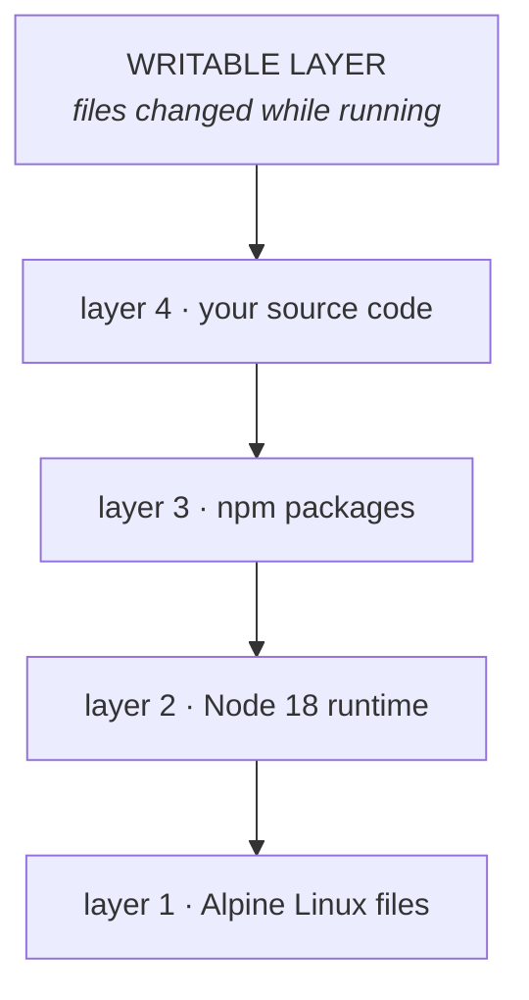

*this container only — deleted when it dies* · *read-only, and SHARED by every container built from this image*

> Ten containers from one image share the read-only layers, stored once. Starting one copies nothing — it just adds a new top layer. And when it dies, that top layer dies with it.

---

# Consequences, and three myths

- Containers are a Linux thing — on macOS or Windows, Docker quietly runs a small Linux VM for you
- Which is exactly why Docker feels slower on a Mac: there is a VM underneath it

| Myth | Reality |
|---|---|
| A container is a lightweight VM | It is a process. There is no second kernel. |
| Containers are automatically secure | Weaker isolation than a VM. Root inside can be dangerous. |
| Docker invented containers | The kernel features predate it. Docker made them usable. |

> So a "lightweight alternative to VMs" sometimes runs inside a VM. Say it out loud; it is funny, and it is true.

---

<!-- _class: lead -->

<span class="kicker">CHAPTER</span>

# Part 2 — Docker

The tool that builds and runs containers

---

# What is Docker, precisely?

**Docker did not invent containers. It made them usable by ordinary people.**

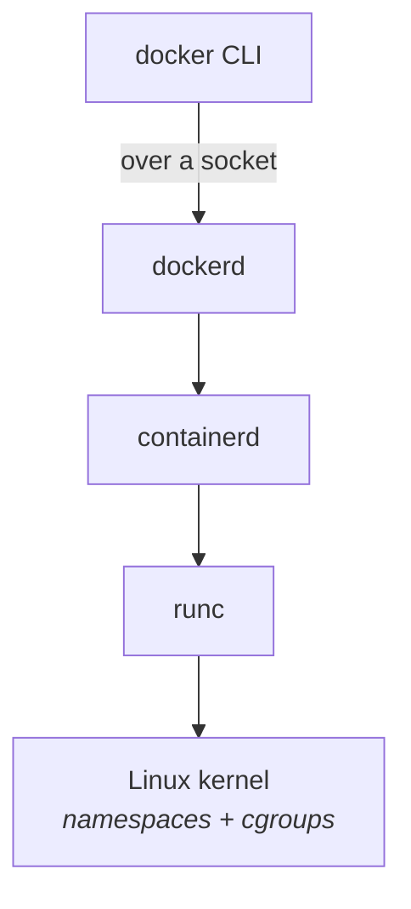

*the command you type* · *background service, does the real work* · *manages the container lifecycle* · *actually talks to the kernel*

> You only ever touch the top box. The lower three follow the OCI standard — which is why Podman, containerd and Kubernetes can all run the same images.


<!--
Speaker notes: Someone always asks 'is Docker dead?' — Kubernetes stopped using dockerd internally in 2022. You still build Docker images. The image format is a standard.
-->

---

<!-- _class: lead -->

<p class="emoji">🐳</p>

# Why is it a whale?

Because it carries containers. That is the whole joke.
The branding meeting finished early that day.

---

# The two words people mix up forever

| Image | Container |
|---|---|
| A file. Sits on disk doing nothing. | A running process. |
| Read-only, frozen. Built once. | Has live state, memory, logs. |
| Like a class in your code. | Like an object created from that class. |
| Like a recipe. | Like the meal you cooked from it. |
| `nsu-guestbook:v1` | the thing listed by `docker ps` |

> One image can produce a thousand identical containers. That single fact is the entire scaling story later.


<!--
Speaker notes: If they remember one table from the whole session, make it this one.
-->

---

# Registries — build once, run anywhere

```
  docker.io / library / postgres : 16-alpine
  ---------   -------   --------   ----------
  registry    namespace repository tag
```

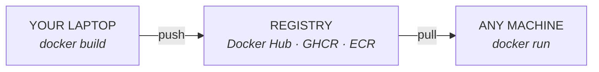

> A tag is a movable nickname; a digest (sha256:…) is permanent. `latest` is NOT the newest version — it is just the default tag name, and deploying it means you cannot say what is in production.

---

# The Dockerfile, and the one habit that matters

**A recipe. Each instruction becomes a cached layer.**

```
FROM node:18-alpine          # base image                  <- cached
WORKDIR /app                 # cd, inside the image        <- cached

COPY package.json ./         # ONLY the dependency list    <- cached
RUN npm install --omit=dev   # the slow one, 60 seconds    <- cached

COPY . .                     # now the source          <- REBUILDS

EXPOSE 3000                  # documents the port
USER node                    # do not run as root. free win.
CMD ["node", "server.js"]    # what runs WHEN IT STARTS
```

> Copy package.json and install BEFORE the source, or every code change reinstalls every dependency. Once one layer is invalidated, everything after it rebuilds too.


<!--
Speaker notes: RUN happens once, at build time. CMD happens every time a container starts. That distinction trips up everyone.
-->

---

<!-- _class: lead -->

<p class="emoji">⏱️</p>

# 3 seconds versus 3 minutes

Times forty rebuilds a day. Times the rest of your career.
This is the highest-paid two-line reordering you will ever do.

---

# The life of a container

**A container lives exactly as long as its main process.**

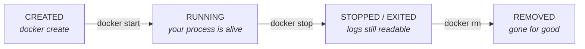

> "My container exits immediately" almost always means the program finished. A container is not a machine you log into — it is a process you wrapped.

---

# Ports — how the outside gets in

```
  docker run -p 8080:3000 myapp
               ----  ----
                 |      +-- port INSIDE the container
                 +--------- port on YOUR machine
```


> EXPOSE in the Dockerfile only documents intent — `-p` is what actually opens the door. "It runs but I cannot open it in the browser" is nearly always a missing -p.

---

# The networking mistake everyone makes

**Inside a container, `localhost` means THAT CONTAINER. Not your laptop.**

- Each container gets its own network namespace and its own IP address
- Two containers on the same user-defined network reach each other by NAME
- Docker runs a small DNS server that resolves those names to IPs

```
DB_HOST=localhost   # wrong inside a container -- it means itself
DB_HOST=db          # right -- the NAME of the other container
```

> We will hit this live in Checkpoint 2, on purpose. Learn the shape of the error: ECONNREFUSED 127.0.0.1:5432


<!--
Speaker notes: Ask the room WHY before you explain. Somebody will get it, and that moment beats the slide.
-->

---

<!-- _class: lead -->

<p class="emoji">↩️</p>

# Calling “localhost” from inside a container

“Hello, database?”
“No. This is you. You called yourself. Nobody else lives here.”

---

# Storage, and the idea everything rests on

**Nothing written inside a container survives the container.**

- A volume is storage Docker manages OUTSIDE the container — use it for real data
- A bind mount maps a folder from your machine in — use it to live-edit code

| Stateless | Stateful |
|---|---|
| Keeps nothing important in itself | Owns data that must survive |
| Any copy can serve any request | Copies are not interchangeable |
| Kill it, restart it, nothing is lost | Kill it carelessly and you lose data |
| Trivial to run ten of | Hard to run more than one correctly |
| Your API, web server, worker | Postgres, MySQL, Redis, file storage |

> Containers are cattle, volumes are pets. Docker and Kubernetes are brilliant at stateless things and merely adequate at stateful ones.


<!--
Speaker notes: This slide explains, in advance, why scaling the API to 5 replicas later is easy and why we never scale Postgres.
-->

---

<!-- _class: lead -->

<p class="emoji">🗑️</p>

# docker compose down -v

The -v stands for volumes.
It also stands for several other words you will say immediately afterwards.

---

# Docker Compose — several containers, one command

**Real apps are more than one container. Typing `docker run` for each is not a plan.**

```
services:
  db:
    image: postgres:16-alpine
    volumes: [ db_data:/var/lib/postgresql/data ]
    healthcheck:
      test: ["CMD-SHELL", "pg_isready -U nsu -d nsu_demo"]
  api:
    build: .
    ports: [ "8080:3000" ]
    environment: { DB_HOST: db }    # <- the service NAME, not an IP
    depends_on: { db: { condition: service_healthy } }
volumes: { db_data: }
```

> Compose puts every service on one network and gives each a DNS name equal to its service name. Hold on to that — Kubernetes Services work the same way, for the same reason.

---

# Where Docker stops

**You launch tonight. Real users. What does Docker not do for you?**

<span style="font-size:2.2em">🛑</span>

- It runs on ONE machine — getting to two is entirely your problem
- Your app crashes at 3 a.m. and nothing restarts it
- Deploying a new version means stopping the old one: downtime
- A container that hangs without exiting keeps receiving traffic
- No rollback button when the new version turns out to be broken
- No way to spread containers across machines by available capacity

> Docker BUILDS and RUNS containers. It does not OPERATE them. That gap has a name: orchestration.


<!--
Speaker notes: This is the hinge of the session. Do not rush it — every Kubernetes feature answers one of these bullets.
-->

---

<!-- _class: lead -->

<p class="emoji">🌙</p>

# 3:00 AM. Your app just crashed.

Docker's plan for this moment: none.
Docker is also asleep. Docker has no idea anything happened.

---

<!-- _class: lead -->

<span class="kicker">CHAPTER</span>

# Part 3 — Kubernetes

Operating containers, across many machines, without you watching

---

# What Kubernetes is, and what it is not

**40 containers, 6 machines. Somebody must decide what runs where — and fix it when it breaks.**

| It IS | It is NOT |
|---|---|
| A system that keeps containers running | A thing that writes or builds your app |
| A scheduler that places them on machines | A replacement for Docker images |
| A self-healing controller | Automatic — you still describe what you want |
| A stable naming and load-balancing layer | Simple — the learning curve is real |
| Portable across clouds and on-premises | Necessary for most small projects |

> Google ran containers internally for a decade on a system called Borg; Kubernetes is the 2014 open-source redesign of those ideas. Greek for "helmsman" — hence the ship's wheel. "K8s" is K, eight letters, s.

---

# The one idea: declare, do not command

```
  IMPERATIVE  (Docker)        "start a container"
                              You said WHAT TO DO, once.
                              If it dies later, that is your problem.

  DECLARATIVE (Kubernetes)    "I want 3 healthy copies of this image"
                              You said WHAT SHOULD BE TRUE, always.
                              Something works continuously to keep it true.
```

> You stop giving orders and start describing the desired end state. Everything else in this session follows from that one shift.


<!--
Speaker notes: The analogy that lands: a thermostat. You do not switch the heater on and off all night. You say 22 degrees, and it works out the rest.
-->

---

# How that works: the control loop

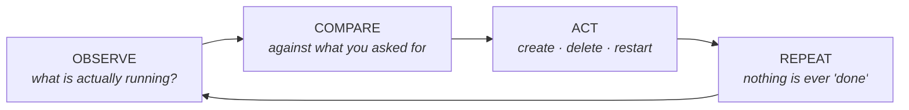

> A "controller" is just a program running this loop for one kind of object. Desired: 3 pods. Actual: 2. Action: create 1. Loop again. That is reconciliation, and it is all of Kubernetes.

---

<!-- _class: lead -->

<p class="emoji">🌡️</p>

# Kubernetes is a thermostat

You do not switch the heater on and off all night.
You say “22 degrees”, and it argues with reality on your behalf, forever.

---

# What a cluster is made of

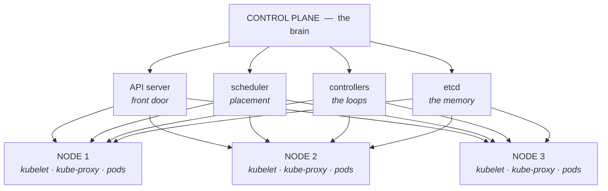

> A node is just a machine that has agreed to run pods. `kubectl` talks only to the API server; the scheduler picks nodes; `kubelet` starts the containers; etcd remembers everything.


<!--
Speaker notes: If etcd is lost, the cluster's memory is lost — which is why production clusters run three or five copies of it.
-->

---

# Everything is an object, and they all look the same

- Namespace = a folder · Pod = the smallest running unit · Deployment = keeps N pods alive
- Service = a stable name in front of pods · ConfigMap and Secret = config · PVC = disk
- StatefulSet (databases) · DaemonSet (one per node) · Job and CronJob (batch work)

```
apiVersion: apps/v1      # which API group and version
kind: Deployment         # WHAT TYPE of object this is
metadata:
  name: api              # its name
  namespace: nsu-demo    # which folder it lives in
spec:                    # WHAT YOU WANT   <- you write this
  replicas: 3
status:                  # WHAT IS TRUE    <- Kubernetes writes this
  readyReplicas: 3
```

> spec is your wish, status is reality, and a controller's whole job is dragging status towards spec.

---

# Why you never write a Pod by hand

**Create a bare pod, delete it, and it is simply gone. Nothing brings it back.**

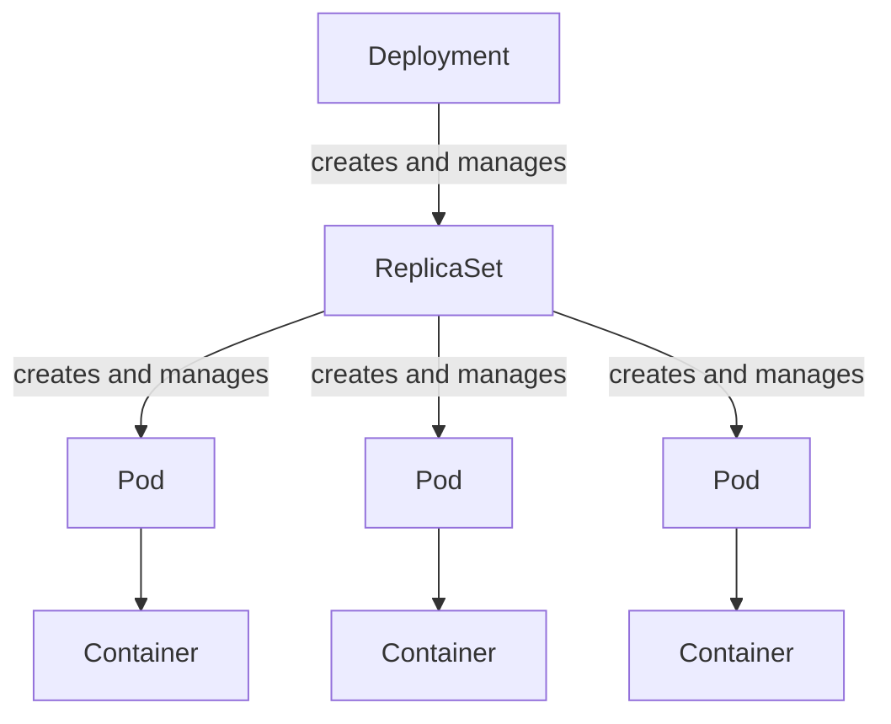

*"3 copies, and update them safely" — the only part you write* · *"there must be exactly 3 pods with this label"* · *one or more containers sharing an IP and storage* · *your image, running*

> Pods are mortal: deleted, rescheduled, and the replacement gets a new IP. You write the Deployment; everything below it is created and repaired for you.

---

# Reading `kubectl get pods`

| Status | What it means |
|---|---|
| Pending | Accepted, not started — no node fits, or the image is still pulling. |
| ContainerCreating | Node chosen, image pulled, container starting. |
| Running | At least one container is up. Not necessarily ready for traffic. |
| CrashLoopBackOff | It keeps starting and dying. Read the logs — this is your bug. |
| ImagePullBackOff | Cannot fetch the image. Wrong name, wrong tag, or no credentials. |
| OOMKilled | It exceeded its memory limit. Raise the limit, or fix the leak. |

> Two statuses cover most beginner pain: CrashLoopBackOff means your app is broken; ImagePullBackOff means your image name is wrong.

---

<!-- _class: lead -->

<p class="emoji">🔁</p>

# CrashLoopBackOff

Your app starts. Your app dies. Repeat.
Kubernetes waits a little longer between attempts — politely, and forever.

---

# Labels — how everything is wired together

**Nothing is connected by name or IP. Everything is connected by label.**

```
# The Deployment stamps every pod it creates:
template:
  metadata:
    labels: { app: api }

# The ReplicaSet counts pods matching:
selector:
  matchLabels: { app: api }

# The Service sends traffic to pods matching:
selector: { app: api }
```

> A label is a key=value sticker; a selector is a query over stickers.


<!--
Speaker notes: The #1 beginner bug in the entire ecosystem: labels and selector disagree, so the Service has zero endpoints and the page just hangs. Check it with `kubectl get endpoints`.
-->

---

# Service — why pod IPs are useless

**Pods are replaced constantly, and every replacement has a different IP.**

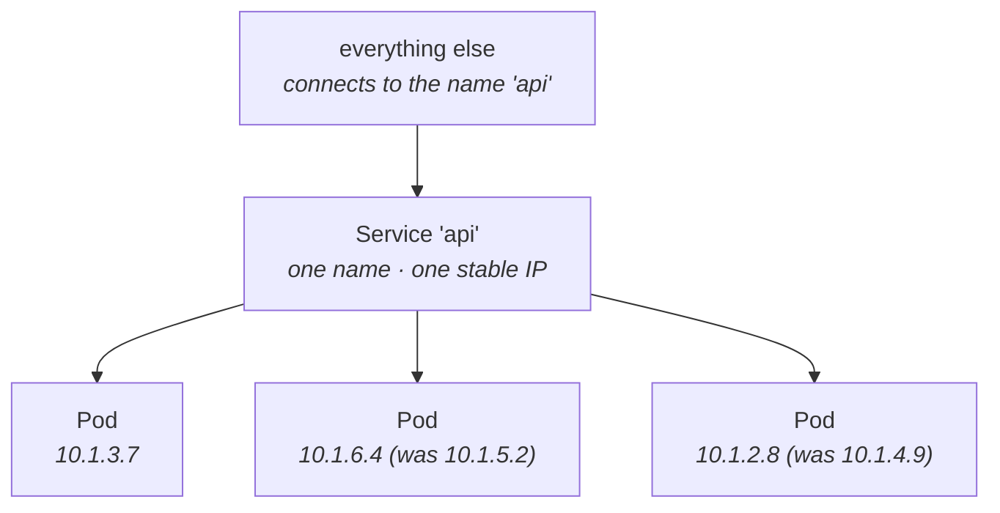

*never changes* · *replaced constantly, new IP every time*

> ClusterIP (internal only, the default) · NodePort (a fixed port on every node, fine for demos) · LoadBalancer (asks the cloud for a real one). Inside the cluster it is simply the hostname `api`.

---

# Ingress — one entrance for many services

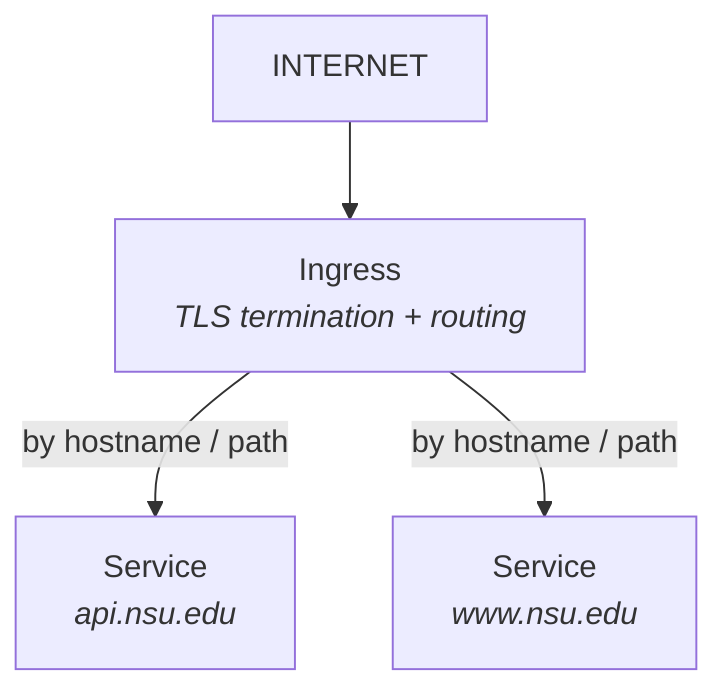

*one entry point for the whole cluster*

> Without it, every public service needs its own cloud load balancer. We are not deploying one today — but every real cluster has one, and it needs a controller installed (nginx, Traefik, or the cloud's).

---

# ConfigMap and Secret — config outside the image

**The same image must run in dev, staging and production. Only the values change.**

```
kind: ConfigMap          # boring config
data: { DB_HOST: postgres, DB_NAME: nsu_demo }
---
kind: Secret             # config that would get you fired
stringData: { DB_PASSWORD: nsu_password }

$ kubectl get secret db-secret -o jsonpath='{.data.DB_PASSWORD}' | base64 -d
nsu_password
```

> A Secret is base64-encoded, NOT encrypted. The real protections are RBAC and encryption-at-rest in etcd. The genuine win here is separation: the credential is not baked into the image.


<!--
Speaker notes: Run the base64 -d command live. Five seconds, remembered for years. Plenty of professionals believe Secrets are encrypted.
-->

---

<!-- _class: lead -->

<p class="emoji">🔓</p>

# “It’s a Secret, so it’s encrypted”

base64 is not encryption. base64 is a hat.
A very small hat, on a very recognisable password.

---

# Storage in Kubernetes

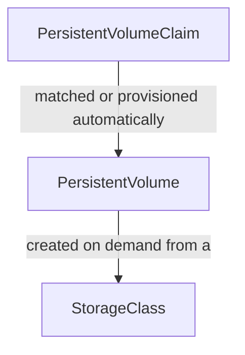

*"I need 1 GB that survives my pod" — the only part you write* · *an actual disk: cloud volume, NFS, local path* · *"fast SSD", "cheap HDD" — the menu of options*

> Your pod asks for storage; it never names a specific disk. Same lesson as Docker volumes: data must live outside the thing that keeps being replaced.

---

# Probes — how the cluster knows your app is healthy

**"The process is running" and "the app works" are not the same statement.**

```
readinessProbe:
  httpGet: { path: /healthz, port: 3000 }
  periodSeconds: 5
```

| Probe | Question | If it fails |
|---|---|---|
| liveness | Are you alive? | Restart the container |
| readiness | Ready for traffic? | Remove from the Service — do not restart |
| startup | Finished booting? | Hold the other probes off a while longer |

> Readiness is what makes zero-downtime deployment possible: a new pod receives traffic only once it says it is ready.

---

# The three tricks that justify all of this

| Trick | What you do | What Kubernetes does |
|---|---|---|
| Scale | `kubectl scale --replicas=5` | The ReplicaSet sees 3 of 5 and creates 2. The Service picks them up automatically — you configured no load balancer. |
| Self-heal | Nothing. Something breaks. | Container crashes → restarted. Pod deleted → recreated. Node dies → rescheduled elsewhere. |
| Rolling update | Change the image or an env var | New pod up → passes readiness → THEN an old one goes. `maxUnavailable: 0` means no downtime. |

> Regret it? `kubectl rollout undo`. Each change created a new ReplicaSet and kept the old ones at zero — so rolling back is just scaling one of them back up.


<!--
Speaker notes: Tie scaling back to the stateless/stateful slide: this only works because the API is stateless. Try it on Postgres and you corrupt data.
-->

---

<!-- _class: lead -->

<p class="emoji">♻️</p>

# You deleted the pod. The pod came back.

You deleted it again. It came back again.
You are not in charge here. The Deployment is in charge here.

---

# When NOT to use Kubernetes

**The most useful slide in this deck, and the one most sessions leave out.**

<span style="font-size:2.2em">🚫</span>

- A student project or a portfolio site — a single container is plenty
- One small app with modest traffic — a VM plus Docker Compose is fine
- Nobody on the team who can debug it at 3 a.m.
- You want a database — use managed Postgres unless you have a real reason
- A cluster you did not need still needs upgrading, securing and paying for

> Kubernetes solves problems of scale. Adopt it when you have those problems, not because it appears on job descriptions.

---

<!-- _class: lead -->

<p class="emoji">🏗️</p>

# A nine-node cluster for your portfolio site

Congratulations! You now have a highly available,
auto-scaling, self-healing platform. And one visitor. Your mother.

---

<!-- _class: lead -->

<span class="kicker">CHAPTER</span>

# Part 4 — Seeing it work

Five checkpoints · run them with me, or later from the repo

---

# Checkpoint 1 — run it with no Docker at all

**A guestbook: Express + Postgres, ~120 lines. Every page prints who served it.**

```
cd checkpoints/01-plain-node
node --version               # must be 18 or newer
npm install
sudo apt-get install -y postgresql
sudo -u postgres psql -c "CREATE USER nsu WITH PASSWORD 'nsu_password';"
sudo -u postgres psql -c "CREATE DATABASE nsu_demo OWNER nsu;"
export DB_HOST=localhost DB_USER=nsu DB_PASSWORD=nsu_password DB_NAME=nsu_demo
npm start
```

> Count the ways this fails: wrong Node, failed install, no Postgres, wrong password, port in use, wrong OS. Eight failure modes, for 120 lines of code.


<!--
Speaker notes: The hostname line — os.hostname() — is the trick of the session. In Docker it prints a container ID; in Kubernetes, a pod name. If the Postgres install is slow, narrate it instead; the struggle IS the content.
-->

---

# Checkpoint 2 — build an image, run a container

```
cd checkpoints/02-docker-single
docker build -t nsu-guestbook:v1 .     # build twice: the second is instant
docker run --rm -p 8080:3000 nsu-guestbook:v1

[db] not ready: connect ECONNREFUSED 127.0.0.1:5432    <- expected!

docker exec -it gb sh                  # look around inside
  cat /etc/os-release                  # Alpine... on your Ubuntu laptop
  whoami                               # node, not root
```

> It fails on purpose. `localhost` inside the container IS the container — the networking slide, made real.


<!--
Speaker notes: Ask the room WHY it failed before you explain it.
-->

---

# Checkpoint 3 — two containers, one command

```
cd checkpoints/03-compose-db
docker compose up --build      # -> http://localhost:8080

# the volume lesson -- do this live:
docker compose down            # containers destroyed
docker compose up -d           # brand new containers
#   refresh: your guestbook entries are STILL THERE
docker compose down -v         # -v also deletes the volume
#   refresh: now they are gone
```

> The app finally works, on any machine, with one command. And the data outlives the container that wrote it.

---

# Checkpoint 4 — the same image on a cluster

```
kind create cluster --config kind-config.yaml   # Kubernetes IN Docker
kubectl get nodes                              # 1 control-plane, 2 workers
docker ps                                      # the nodes ARE containers

kind load docker-image nsu-guestbook:v1 --name nsu   # its own image store
kubectl apply -f k8s/
kubectl get all -n nsu-demo
```

> Identical image. Namespace, Deployment, Service — the objects from Part 3, now real. Skip the `kind load` line and you get ImagePullBackOff, which is worth demoing on purpose.


<!--
Speaker notes: CREATE THE CLUSTER BEFORE THE SESSION. It takes 1-3 minutes on good wifi and much longer on bad wifi.
-->

---

# Checkpoint 5 — scale, heal, ship

```
# 1. SCALE -- then refresh the browser and watch "Served by" change
kubectl scale deploy/api --replicas=5 -n nsu-demo

# 2. SELF-HEAL -- kill them all; replacements appear in seconds
kubectl delete pods -n nsu-demo -l app=api

# 3. ROLLING UPDATE -- refresh throughout; it never errors
kubectl set env deploy/api APP_VERSION=v2 -n nsu-demo
kubectl rollout undo deploy/api -n nsu-demo
```

> Three commands. Everything Part 3 promised, visible in ninety seconds. Keep localhost:8080 on the projector throughout.


<!--
Speaker notes: The 'Served by' hostname changing as you refresh is the single best demo in the session. Let it run.
-->

---

# The entire session on one slide

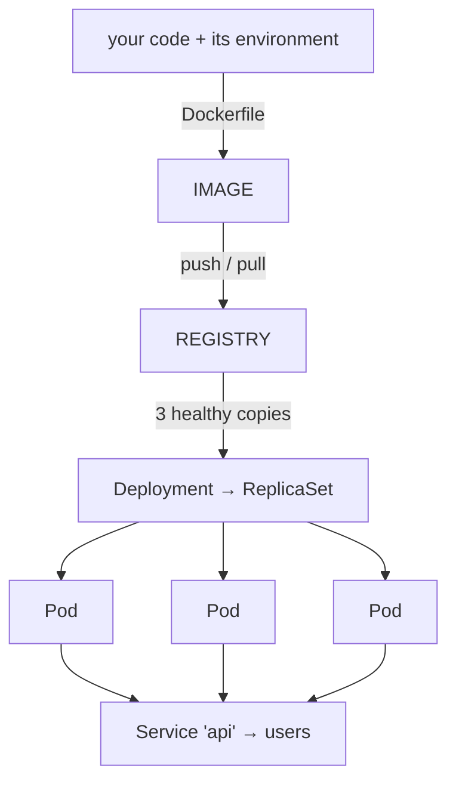

> One image. Many identical pods. One stable name. A controller that never stops checking.

---

# Compose and Kubernetes are the same ideas, renamed

| Docker Compose | Kubernetes |
|---|---|
| service | Deployment + Service |
| docker compose up | kubectl apply -f |
| container | Pod (which contains containers) |
| service name as hostname | Service name as hostname |
| named volume | PersistentVolumeClaim |
| environment: | ConfigMap and Secret |
| healthcheck: | liveness and readiness probes |
| (not available) | replicas, self-healing, rolling updates, scheduling |

> You already understood most of Kubernetes by the end of Part 2. It just used different words.

---

# Glossary — the Docker half

| Term | One line |
|---|---|
| Image | A read-only package of an app and everything it needs. |
| Container | A running instance of an image; an isolated process. |
| Layer | One cached step of an image build. |
| Dockerfile | The recipe used to build an image. |
| Registry | A server that stores and serves images. |
| Tag | A movable nickname for a version of an image. |
| Volume | Storage that outlives the container. |
| Bind mount | A folder from your machine, mapped into a container. |
| Compose | A file and a command for running several containers together. |

---

# Glossary — the Kubernetes half

| Term | One line |
|---|---|
| Cluster / Node | Machines managed together as one pool / one machine in it. |
| Control plane | The brain: API server, etcd, scheduler, controllers. |
| Pod | The smallest deployable unit; wraps containers. |
| Deployment | Keeps N pods alive and updates them safely. |
| ReplicaSet | Counts pods, creating or deleting to hit the number. |
| Service | A stable name and IP in front of changing pods. |
| Label / selector | Sticker and query — how objects find each other. |
| ConfigMap / Secret | Configuration and credentials injected at runtime. |
| PVC | A request for storage that outlives the pod. |
| Namespace | A folder separating groups of objects. |

---

# If you remember only five things

<span style="font-size:2.2em">⭐</span>

- An app is code PLUS its environment — that is why shipping code alone fails
- A container is a normal process the kernel has isolated. Not a small VM
- An image is the frozen recipe; a container is a running instance of it
- Kubernetes compares desired state with actual state, forever
- Anything you care about keeping must live OUTSIDE the container

> Next: containerise one project of your own this week — that is the whole homework. Then kubernetes.io/docs/tutorials/kubernetes-basics, then Ingress, then Helm. Learn `kubectl describe` before anything else.


<!--
Speaker notes: The Events section at the bottom of `kubectl describe pod` answers nine out of ten 'why will it not start' questions. Say so explicitly.
-->

---

<!-- _class: lead -->

<p class="emoji">🎓</p>

# That is genuinely all of it

Everything else is detail, documentation, and YAML.
Mostly YAML.

---

<!-- _class: lead -->

<span class="kicker">CHAPTER</span>

# Questions?

Slides, checkpoints and a cheat sheet are all in the repo — thank you
